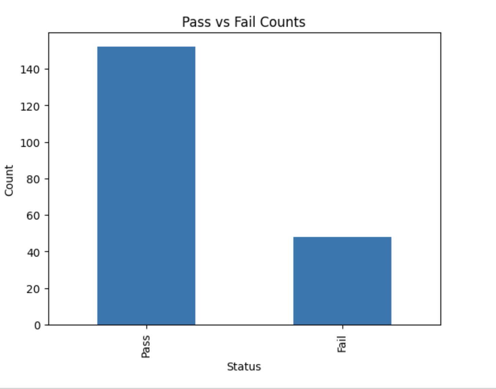

# Laboratory QC Data Analysis

## Objective
Analyze laboratory quality control (QC) data to understand pass/fail trends and identify potential variability in results.

## Project Overview
This project simulates laboratory quality control QC) data and analyzes it using Python to identify trends, failures, and possible sources of variation.

## What I Did
- Created a dataset with 200 lab test results
- Set a specification limit (0.05)
- Classified results as Pass or Fail
- Calculated pass/fail counts
- Analyzed trends over time
- Compared results between test types (Endotoxin vs Bioburden)

## Key Findings
- ~76% of tests passed, ~24% failed
- Failures occurred across multiple dates
- No strong trend of increasing failures over time
- Endotoxin results were slightly higher average than Bioburden, but both remained below the specification limit

## Conclusion
The process appears generally stable, but periodic failures suggest the need for continued monitoring and potential investigation.

## Sample Output

This visualization shows that most tests **passed (~76%)**, while a smaller portion **failed (~24%)**, indicating a generally stable QC process. 

## Tools Used
- Python
- Pandas
- NumPy
- Matplotlib

## Project File
- `Lab_QC_Trend_Analysis.ipynb`

## How to Run

1. Open the notebook in Google Colab or Jupyter Notebook
2. Run all cells to generate the dataset and analysis
3. View plots and summary outputs
